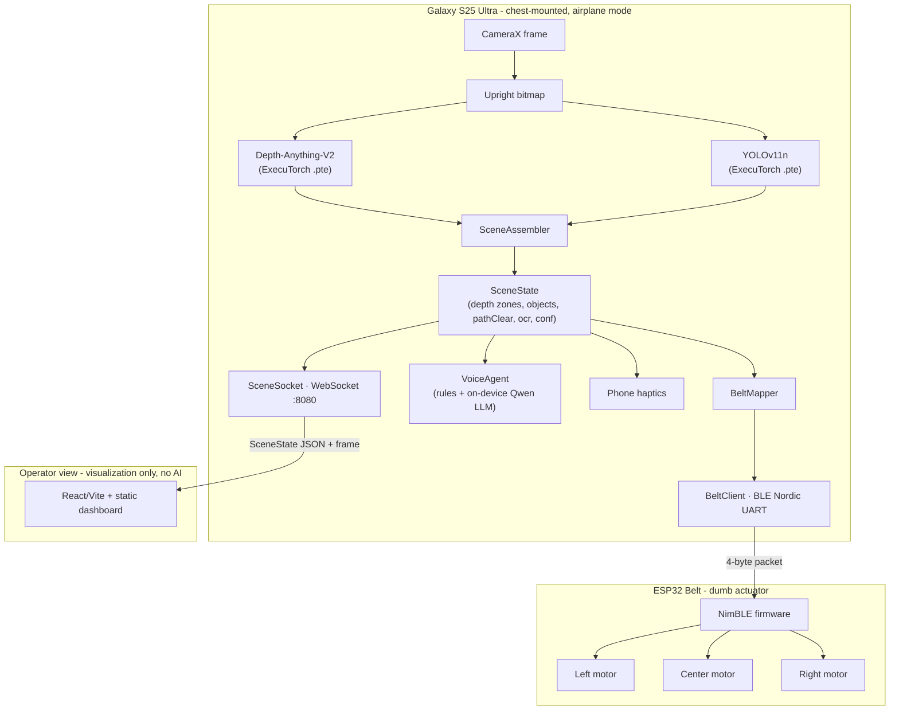

# SixthSense 🏆 - 2nd Place, Qualcomm x Meta Hackathon

**An on-device navigation copilot for blind and low-vision users.**

[](android/app/src/test)
[](android)
[](https://pytorch.org/executorch)
[](android)
[](firmware/esp32_belt)
[](dashboard)
[](LICENSE)

A chest-mounted Samsung Galaxy S25 Ultra watches the path ahead, runs depth, object detection, and language models locally through ExecuTorch (with the Qualcomm QNN backend where available), folds every frame into one compact `SceneState`, and turns that state into a haptic belt buzz, a spoken answer, and a live operator view. The entire assistive path runs on the phone and keeps working in airplane mode once the app and models are on device.

---

## How It Works

A single camera frame travels the whole system in tens of milliseconds, fully on the phone:

1. **CameraX** captures a frame and rotates it once into a shared upright bitmap.
2. **Depth-Anything-V2** estimates relative nearness; **YOLOv11n** detects objects. Both run as ExecuTorch `.pte` models in parallel on separate threads, so per-frame latency is about `max(depth, yolo)` instead of the sum.
3. The **SceneAssembler** fuses depth and detections into one `SceneState`: per-zone nearness (left, center, right), detected objects with their zone, a `pathClear` verdict, optional OCR text, and a confidence score.
4. The **BeltMapper** turns that state into a 4-byte packet, fusing depth and detected objects (it takes the stronger signal per zone) and choosing a pattern: steady, a low-confidence caution pulse, or a double pulse for a curb or step ahead.
5. The packet drives three outputs at once: the **BLE haptic belt**, the **phone haptics** as a backup, and an optional **voice answer** when the user asks a push-to-talk question.
6. A **WebSocket** broadcasts the same `SceneState` (and a downscaled frame) to a visualization-only dashboard for sighted operators and judges.

The thesis is simple: navigation safety should not depend on cloud connectivity. There are no cloud APIs and no external model calls anywhere in the assistive runtime.

---

## Architecture



Everything is organized around one contract: `SceneState`. Every component either produces or consumes it. Mock mode emits the exact same contract as the real pipeline, so the belt, voice agent, and dashboard could be built and validated before the on-device models were ready.

---

## Pipeline and Components

| Component | Role | Technology |
|---|---|---|
| VisionPipeline | Live on-device perception, parallel depth + detection inference | CameraX + ExecuTorch (QNN / XNNPACK) |
| Depth model | Per-zone obstacle nearness from a single camera | Depth-Anything-V2 (518x518 input, runs 1 in 3 frames) |
| Detection model | Object labels and boxes placed into left/center/right zones | YOLOv11n (640x640 input, every frame) |
| SceneState | The single contract every component produces or consumes | Kotlin data classes |
| BeltMapper | SceneState to a 4-byte packet with intensity and pattern logic | Pure Kotlin, fully unit-tested |
| BeltClient | BLE connection and GATT writes to the belt | Android BLE, Nordic UART UUIDs |
| PhoneHaptics | Directional buzz on the phone as a belt backup | Android Vibrator |
| VoiceAgent | Push-to-talk answers grounded in the current scene | Keyword intent routing + on-device Qwen via ExecuTorch |
| SceneSocket | Streams SceneState and a downscaled frame to dashboards | WebSocket on port 8080 |
| ESP32 firmware | Drives three vibration motors from the packet | ESP32 + NimBLE + ULN2803A driver |
| MCP server | Development and debugging command center over adb | Python FastMCP (never in the assistive path) |

---

## Repo Structure

```
android/                 Android Studio project (Kotlin, package com.sixthsense)
  app/src/main/.../vision   VisionPipeline, ExecuTorch modules, YOLO/depth decoders
  app/src/main/.../core     SceneState contract, BeltMapper, SceneBus, mock producer
  app/src/main/.../ble      BeltClient (BLE Nordic UART)
  app/src/main/.../haptics  Phone haptics + directional encoding
  app/src/main/.../voice    VoiceAgent + on-device LLM engine
  app/src/main/.../ws       SceneSocket (WebSocket :8080)
  app/src/debug/.../debug   DebugReceiver (debug build variant only)
  app/src/test              Unit tests (BeltMapper, directional encoding, decoders)
firmware/esp32_belt/     ESP32 NimBLE belt firmware (dumb actuator) + wiring guide
dashboard/               React + Vite + TypeScript visualization
live-dashboard/          Framework-free static dashboard (deployable anywhere)
mcp/                     Python FastMCP dev/debug server
scripts/                 setup_mcp.sh, verify_android_env.sh, adb helpers
docs/                    Project context, setup, model export, risk register, MCP checklist
CLAUDE.md                Architecture, MVP ladder, and dev-tooling rules
```

---

## Quick Start

The target device is a Samsung Galaxy S25 Ultra connected over USB-C adb. Development was done on MacBooks.

```bash
git clone https://github.com/shanayg15/SixthSense-QualcommxMeta.git
cd SixthSense-QualcommxMeta
bash scripts/verify_android_env.sh
```

1. **Install prerequisites:** Android Studio with SDK Platform Tools, Node 18+, Python 3.10+, and ideally [`uv`](https://docs.astral.sh/uv). Full detail in [docs/galaxy_s25_mac_setup.md](docs/galaxy_s25_mac_setup.md).
2. **Set `ANDROID_HOME`** in `~/.zshrc`:
   ```bash
   export ANDROID_HOME="$HOME/Library/Android/sdk"
   export PATH="$ANDROID_HOME/platform-tools:$PATH"
   ```
3. **Open the `android/` folder** (not the repo root) in Android Studio, let Gradle sync, then build the debug variant.
4. **Enable USB debugging** on the phone (tap Build number 7 times, then Developer options to USB debugging), plug in a data-capable cable, and confirm:
   ```bash
   adb devices -l
   ```
5. **Add models.** Drop the ExecuTorch `.pte` files into `android/app/src/main/assets/models/` (see [docs/model_export_plan.md](docs/model_export_plan.md)). With no models present the app stays in Mock mode and every consumer still runs.

### Run the dashboard

```bash
cd dashboard
npm install
npm run dev -- --host 127.0.0.1
```

Set the phone IP in the UI to connect to `ws://PHONE_IP:8080`. The framework-free `live-dashboard/` is a static alternative that can be hosted anywhere.

### Flash the belt

See [firmware/esp32_belt/README.md](firmware/esp32_belt/README.md): Arduino IDE plus the ESP32 board package and NimBLE-Arduino, three vibration motors wired through a ULN2803A driver (never straight off a GPIO), flash `esp32_belt.ino`, and verify with nRF Connect before connecting the app.

---

## Belt Packet Protocol

The phone and firmware agree on a 4-byte packet sent over the Nordic UART Service:

```
[ left, center, right, pattern ]
   0-255  0-255   0-255   0|1|2
```

| Pattern | Meaning |
|---|---|
| `0` steady | Normal directional buzz from depth and detected objects |
| `1` pulse | Low-confidence caution (center only, no claimed direction) |
| `2` double | Curb or step ahead (strong center, takes priority) |

Example packets:

| Packet (hex) | Meaning |
|---|---|
| `C8 00 00 00` | Strong left buzz, steady |
| `00 B4 00 02` | Center double pulse, curb or step ahead |
| `00 00 DC 00` | Strong right buzz, steady |
| `1E 1E 1E 00` | Gentle all-clear hum on every motor |
| `00 50 00 01` | Low-confidence caution pulse |

The BeltMapper fuses depth and detected objects per zone (it keeps the stronger signal so they reinforce rather than cancel), and a confirmed detection is allowed to warn slightly earlier than raw depth.

---

## Tech Stack

| Layer | Technology |
|---|---|
| App | Android, Kotlin, CameraX, Coroutines |
| On-device inference | ExecuTorch with the Qualcomm QNN backend (XNNPACK fallback) |
| Vision models | Depth-Anything-V2 (depth), YOLOv11n (detection) |
| Voice | Keyword intent routing plus an on-device Qwen LLM through ExecuTorch, fully offline |
| Belt | ESP32, NimBLE, ULN2803A motor driver, three vibration motors |
| Transport | BLE Nordic UART Service (belt), WebSocket on :8080 (dashboard) |
| Dashboards | React + Vite + TypeScript, and a dependency-free static build |
| Dev tooling | Python FastMCP server driving adb (development and debugging only) |

---

## Tests

Twenty-one unit tests cover the deterministic core: belt mapping, directional encoding, and the model decoders.

```bash
cd android
./gradlew testDebugUnitTest
```

The belt mapping logic, the part that decides what the user feels, is pure Kotlin with no Android or model dependencies, so it is fully testable without a device.

---

## Safety Rules

- The phone performs all perception and reasoning locally; the assistive path never makes a network call.
- The belt is a dumb actuator and the dashboard is visualization only.
- The system keeps working in airplane mode once the app and models are on device.
- Low confidence never claims a clear direction; it falls back to a cautious center pulse.
- Curb and step detection takes priority over every other signal.
- The MCP server and all debug broadcast tooling are development-only and ship solely in the debug build variant. They touch the device through adb and are absent from the live runtime.

---

## Documentation

| Doc | Description |
|---|---|
| [CLAUDE.md](CLAUDE.md) | Architecture, the MVP ladder, and the dev-tooling rules |
| [docs/galaxy_s25_mac_setup.md](docs/galaxy_s25_mac_setup.md) | Full MacBook plus Galaxy S25 setup and adb path |
| [docs/model_export_plan.md](docs/model_export_plan.md) | How the ExecuTorch `.pte` models are exported |
| [docs/ondevice_vision_and_phone_haptics.md](docs/ondevice_vision_and_phone_haptics.md) | The on-device vision and phone haptics design |
| [docs/risk_register.md](docs/risk_register.md) | Project risks and mitigations |
| [mcp/README.md](mcp/README.md) | The development and debugging MCP server |
| [firmware/esp32_belt/README.md](firmware/esp32_belt/README.md) | Belt wiring, flashing, and packet testing |

---

## License

[MIT](LICENSE) - built for the Qualcomm x Meta Hackathon.
